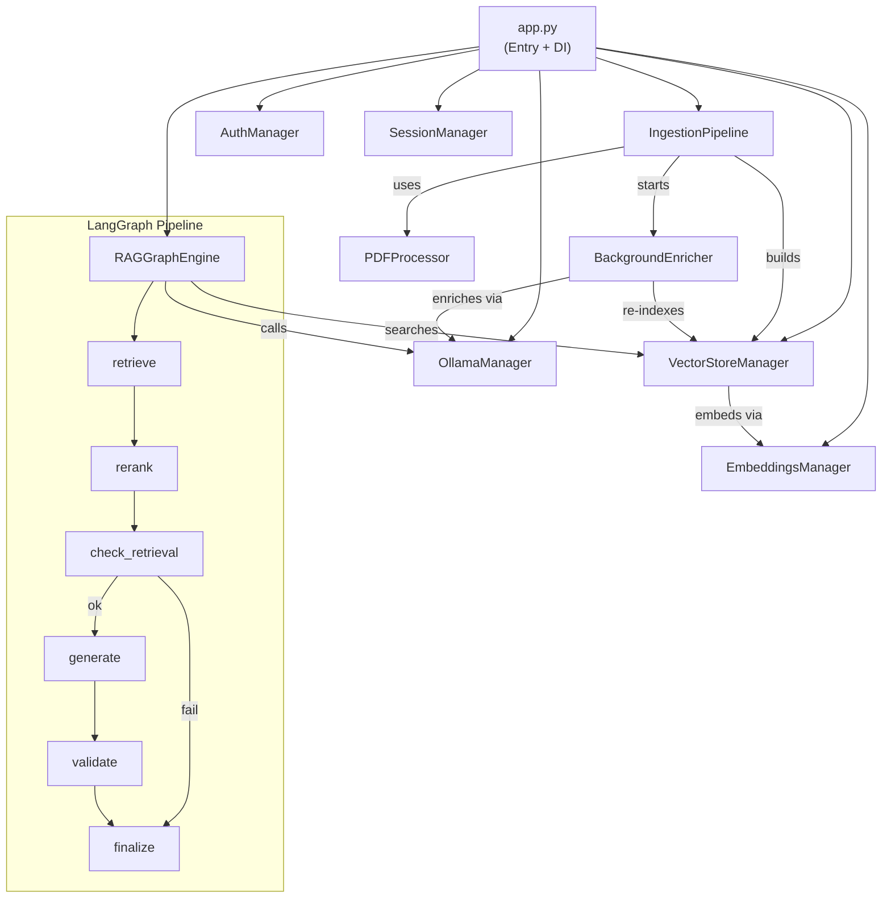

# 🏗️ Architecture

PrivateGPT is a fully air-gapped, local-first document intelligence system. It runs entirely on the user's machine — no cloud services, no telemetry, no external API calls. Every component is designed with this constraint as the primary architectural driver.

---

## High-Level Architecture

```
┌──────────────────────────────────────────────────────────────────────┐
│                     Electron Desktop Frontend                        │
│  ┌──────────┐ ┌──────────┐ ┌──────────┐ ┌──────────┐ ┌───────────┐ │
│  │   Chat   │ │Documents │ │  Models  │ │ History  │ │   Admin   │ │
│  └────┬─────┘ └────┬─────┘ └────┬─────┘ └────┬─────┘ └─────┬─────┘ │
│       │             │            │             │             │       │
│  ┌────┴─────────────┴────────────┴─────────────┴─────────────┴────┐ │
│  │                       Sidebar (Navigation + State)              │ │
│  └─────────────────────────────┬───────────────────────────────────┘ │
└────────────────────────────────┼─────────────────────────────────────┘
                                 │ HTTP + SSE (FastAPI)
                    ┌────────────┴────────────┐
                    │      backend/server.py  │
                    │   (REST API + Routing)  │
                    └────────────┬────────────┘
                                 │
        ┌────────────────────────┼────────────────────────┐
        │                        │                        │
┌───────┴───────┐    ┌───────────┴──────────┐   ┌────────┴────────┐
│  core/ Layer  │    │  security/ Layer     │   │ sessions/ Layer │
│  (Pure Python)│    │  (Auth + Audit)      │   │ (Chat History)  │
└───────┬───────┘    └────────────────────┘   └─────────────────┘
        │
   ┌────┴──────────────────────────────────────────┐
   │              Core Components                    │
   │                                                 │
   │  ┌──────────────┐  ┌────────────────────────┐  │
   │  │PDFProcessor  │  │  IngestionPipeline     │  │
   │  │(3-tier       │─▶│  (Chunk + Index)       │  │
   │  │ extraction)  │  └───────────┬────────────┘  │
   │  └──────────────┘              │                │
   │                      ┌─────────┴──────────┐     │
   │                      ▼                    ▼     │
   │            ┌──────────────┐     ┌───────────┐   │
   │            │VectorStore   │     │Background │   │
   │            │Manager       │     │Enricher   │   │
   │            │(FAISS+BM25)  │     │(daemon)   │   │
   │            └──────┬───────┘     └───────────┘   │
   │                   │                              │
   │            ┌──────┴───────┐                      │
   │            │RAGGraphEngine│                      │
   │            │(LangGraph)   │                      │
   │            └──────┬───────┘                      │
   │                   │                              │
   │            ┌──────┴───────┐                      │
   │            │  Ollama LLM  │◀── OllamaManager    │
   │            │  (localhost)  │                      │
   │            └──────────────┘                      │
   └──────────────────────────────────────────────────┘
```

---

## Design Principles

### 1. Air-Gapped by Design

Every component is selected for offline operation:
- **Ollama** runs LLMs locally — no OpenAI, no API keys
- **FAISS** stores vector indexes on local disk — no Pinecone, no cloud vector DBs
- **sentence-transformers** embeds text on the local CPU — no embedding API calls
- **Tesseract OCR** runs locally — no Google Vision, no AWS Textract
- **PBKDF2-HMAC-SHA256** for password hashing — no external auth services

The only network call is the initial one-time download of Ollama models. After that, the system is fully functional without internet.

### 2. Clean Layer Separation

```
┌─────────────────────────────────────┐
│  Electron UI Layer (electron/)      │  Desktop frontend. No business logic.
│  - SPA rendering                    │  Communicates via REST and SSE.
│  - Main process and Window          │
├─────────────────────────────────────┤
│  FastAPI Backend (backend/)         │  REST API + Event routing.
│  - Endpoint definitions             │  Connects the UI to the core logic.
│  - SSE Streaming endpoints          │
├─────────────────────────────────────┤
│  Core Layer (core/)                 │  Pure Python. Zero UI/Backend dependencies.
│  - PDF extraction                    │  Can be tested independently.
│  - Embeddings, vector store          │  Thread-safe where needed.
│  - LangGraph RAG pipeline           │
├─────────────────────────────────────┤
│  Config Layer (config/)             │  Dataclass-based settings singleton.
│  - All paths, model names, params    │  Auto-creates dirs on import.
├─────────────────────────────────────┤
│  Support Layers                     │
│  - security/ (auth + audit)          │  PBKDF2 hashing, JSON persistence.
│  - sessions/ (chat history)          │  Per-user JSON file storage.
└─────────────────────────────────────┘
```

**Why this matters:** The core layer has zero Electron/FastAPI dependencies. You can import and use `PDFProcessor`, `VectorStoreManager`, or `RAGGraphEngine` in a plain Python script or a test harness.

### 3. Singleton Pattern via Module-Level Instantiation

Heavy objects are loaded exactly once and kept in RAM:

| Object | Load time | Memory | Reused across |
|--------|-----------|--------|---------------|
| `EmbeddingsManager` | ~10s (first load) | ~80 MB | All requests |
| `VectorStoreManager` | ~4s (first load) | Varies by index size | All requests |
| `OllamaManager` | Instant | Negligible | All requests |
| `AuthManager` | Instant | Negligible | All requests |
| `SessionManager` | Instant | Negligible | All requests |

**Why:** Loading the embedding model from disk takes 10 seconds. By instantiating it once at the module level in the FastAPI backend, it stays resident in memory and handles all subsequent API requests instantly.

### 4. Dependency Injection

Core components receive their dependencies through constructor arguments, not global imports:

```python
# In backend/server.py — the only place where wiring happens
embeddings = EmbeddingsManager(settings.embedding_model)
embeddings.preload()
vsm = VectorStoreManager(settings.index_dir, embeddings)
ollama = OllamaManager()
```

**Why:** This makes every core class independently testable. You can construct a `VectorStoreManager` with a mock `EmbeddingsManager` in a unit test — no UI, no Ollama, no disk.

---

## Directory Structure

```
PrivateGPT/
├── app.py                      # Entry point + DI wiring
├── requirements.txt            # Python dependencies
├── .gitignore
│
├── config/
│   ├── __init__.py
│   └── settings.py             # Settings dataclass (singleton)
│
├── core/                       # Pure business logic (no Streamlit)
│   ├── __init__.py
│   ├── pdf_processor.py        # 3-tier PDF extraction (text/table/OCR)
│   ├── embeddings.py           # EmbeddingsManager (sentence-transformers)
│   ├── ingestion.py            # IngestionPipeline (PDF → chunks → FAISS)
│   ├── vector_store.py         # VectorStoreManager (FAISS + BM25 + neighbors)
│   ├── enrichment.py           # BackgroundEnricher (daemon thread)
│   ├── ollama_manager.py       # OllamaManager (server + model lifecycle)
│   ├── ssl_patch.py            # Shared SSL bypass for HuggingFace
│   ├── query_engine_legacy.py  # Legacy query engine (superseded by graph/)
│   └── graph/                  # LangGraph RAG pipeline
│       ├── __init__.py
│       ├── state.py            # RAGState TypedDict
│       ├── nodes.py            # 6 graph node functions
│       ├── builder.py          # StateGraph construction
│       └── engine.py           # RAGGraphEngine (public API)
│
├── security/
│   ├── __init__.py
│   └── auth.py                 # AuthManager (PBKDF2 + audit log)
│
├── sessions/
│   └── manager.py              # SessionManager (per-user JSON files)
│
├── ui/                         # Streamlit presentation layer
│   ├── __init__.py
│   ├── styles.py               # CSS injection (dark theme)
│   ├── sidebar.py              # Sidebar rendering
│   └── pages/
│       ├── __init__.py
│       ├── chat.py             # Chat page (streaming)
│       ├── documents.py        # Document Manager page
│       ├── models.py           # Model Manager page
│       ├── history.py          # Chat History page
│       └── admin.py            # User Management + Audit Log
│
├── data/                       # Runtime data (gitignored)
│   ├── documents/              # Permanent PDF copies
│   ├── faiss_index/            # FAISS + BM25 indexes + metadata
│   ├── sessions/               # Per-user chat session JSON files
│   └── security/               # users.json + audit.log
│
└── docs/                       # This documentation
```

---

## Component Interaction Map



---

## Data Flow Summary

| Flow | Path |
|------|------|
| **PDF → Index** | Upload → `PDFProcessor` (3-tier) → `RecursiveCharacterTextSplitter` → `FAISS.from_documents()` + `BM25Okapi` → disk |
| **Query → Answer** | Question → `hybrid_search` (FAISS + BM25 RRF) → neighbor expansion → cross-encoder rerank → prompt template → Ollama LLM → streaming tokens |
| **Login → Session** | Username/password → `PBKDF2-HMAC-SHA256` verify → audit log → `SessionManager.create()` → `st.session_state` |
| **Enrichment** | Background daemon → per-chunk LLM context generation → re-embed → replace FAISS index → `mark_dirty()` |
