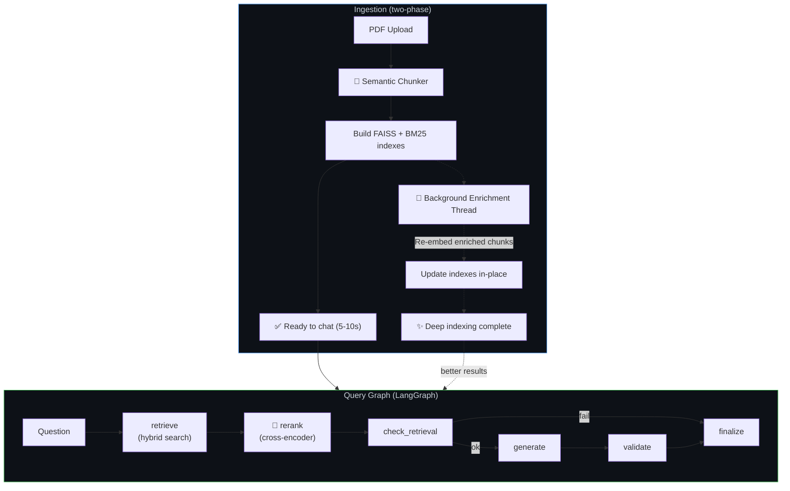
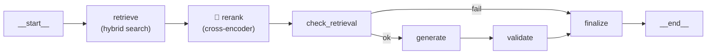

# Next-Gen Pipeline — Updated Implementation Plan

Upgrade the ingestion + retrieval pipeline with three breakthrough techniques and progressive enhancement UX. All fully offline, +125 MB RAM, works on any laptop that runs the current system.

## Architecture Overview



---

## Proposed Changes

Changes are grouped by component, ordered by dependency (build bottom-up).

---

### Component 1: Configuration

#### [MODIFY] [settings.py](file:///d:/PrivateGPT/config/settings.py)

Add new parameters after the existing LLM section:

```python
# ── Semantic Chunking ─────────────────────────────────────────
breakpoint_threshold_type: str = "percentile"
breakpoint_threshold_amount: int = 85

# ── Contextual Enrichment ─────────────────────────────────────
contextual_enrichment: bool = True
context_model: str = "phi3"          # Small/fast Ollama model for context gen

# ── Hybrid Search ─────────────────────────────────────────────
hybrid_search: bool = True
bm25_weight: float = 0.4
faiss_weight: float = 0.6

# ── Reranking ─────────────────────────────────────────────────
reranker_model: str = "cross-encoder/ms-marco-MiniLM-L-6-v2"
rerank_candidates: int = 40          # Candidates fed to reranker
rerank_top_n: int = 4                # Final chunks after reranking
```

Add derived path:

```python
@property
def bm25_index_path(self) -> Path:
    return self.index_dir / "bm25_index.pkl"
```

---

### Component 2: Ingestion Pipeline (Major Rewrite)

#### [MODIFY] [ingestion.py](file:///d:/PrivateGPT/core/ingestion.py)

**Changes to `_run()` method:**

1. **Replace** `RecursiveCharacterTextSplitter` → `SemanticChunker`

```python
# OLD
from langchain_text_splitters import RecursiveCharacterTextSplitter
splitter = RecursiveCharacterTextSplitter(chunk_size=800, chunk_overlap=150)
chunks = splitter.split_documents(pages)

# NEW
from langchain_experimental.text_splitter import SemanticChunker
chunker = SemanticChunker(
    embeddings=self._embeddings,
    breakpoint_threshold_type=self._settings.breakpoint_threshold_type,
    breakpoint_threshold_amount=self._settings.breakpoint_threshold_amount,
)
chunks = chunker.split_documents(pages)
```

2. **Add** BM25 index creation alongside FAISS

```python
# After building FAISS, also build BM25
from rank_bm25 import BM25Okapi
import pickle

corpus = [doc.page_content for doc in all_indexed_docs]
tokenized = [text.lower().split() for text in corpus]
bm25 = BM25Okapi(tokenized)

with open(self._settings.bm25_index_path, "wb") as f:
    pickle.dump({"bm25": bm25, "docs": all_indexed_docs}, f)
```

3. **After** immediate indexing completes, **launch background enrichment** if Ollama is running

```python
if self._settings.contextual_enrichment:
    from core.enrichment import BackgroundEnricher
    enricher = BackgroundEnricher(self._settings, self._embeddings, self._vsm)
    enricher.start(chunks)  # non-blocking background thread
```

**Changes to `rebuild()` method:** Same pattern — semantic chunk, build both indexes, launch background enrichment.

**EMBEDDING_BACKEND** version bump: `"sentence-transformers-v2-semantic"` — forces auto re-index for users upgrading from v1.

---

### Component 3: Background Enrichment Engine (New File)

#### [NEW] [enrichment.py](file:///d:/PrivateGPT/core/enrichment.py)

New class: `BackgroundEnricher` — manages the progressive enhancement lifecycle.

```python
class BackgroundEnricher:
    """
    Background thread that enriches chunks with LLM-generated context.
    
    Progressive enhancement: system is queryable immediately,
    quality improves silently in the background.
    """
    
    CONTEXT_PROMPT = """You are a document indexing assistant. Given a chunk 
of text from "{filename}" (page {page}), write a concise 1-2 sentence 
context that explains what document this is from and what this specific 
section covers. This context will be prepended to the chunk for search.

Chunk:
{chunk_text}

Context (1-2 sentences only):"""

    BATCH_SIZE = 5  # chunks per Ollama call
    
    def __init__(self, settings, embeddings, vsm):
        self._settings = settings
        self._embeddings = embeddings
        self._vsm = vsm
        self._thread = None
        self._progress = {"total": 0, "done": 0, "running": False}
    
    def start(self, chunks):
        """Launch background enrichment (non-blocking)."""
        self._progress = {"total": len(chunks), "done": 0, "running": True}
        self._thread = threading.Thread(
            target=self._enrich_loop,
            args=(chunks,),
            daemon=True,
        )
        self._thread.start()
    
    @property
    def status(self):
        """For UI status badge: {running, total, done}."""
        return dict(self._progress)
    
    def _enrich_loop(self, chunks):
        """Process chunks in batches, re-embed, update index."""
        from langchain_ollama import OllamaLLM
        
        llm = OllamaLLM(
            model=self._settings.context_model,
            temperature=0.0,
        )
        
        for batch in self._batched(chunks, self.BATCH_SIZE):
            # Skip junk chunks (TOC, copyright, blank pages)
            batch = [c for c in batch if not self._is_junk(c)]
            if not batch:
                continue
            
            for chunk in batch:
                try:
                    context = llm.invoke(self.CONTEXT_PROMPT.format(
                        filename=chunk.metadata.get("source_file", "unknown"),
                        page=chunk.metadata.get("page", "?"),
                        chunk_text=chunk.page_content[:500],
                    ))
                    # Prepend context to chunk content
                    chunk.page_content = f"[Context: {context.strip()}]\n{chunk.page_content}"
                    chunk.metadata["enriched"] = True
                except Exception:
                    pass  # Skip failed chunks, keep original
                
                self._progress["done"] += 1
        
        # Re-build indexes with enriched chunks
        self._rebuild_indexes(chunks)
        self._progress["running"] = False
    
    def _rebuild_indexes(self, chunks):
        """Replace FAISS + BM25 with enriched versions."""
        # ... rebuild both indexes, call vsm.mark_dirty()
    
    @staticmethod
    def _is_junk(chunk):
        """Skip copyright pages, TOC, blank pages."""
        text = chunk.page_content.strip().lower()
        if len(text) < 50:
            return True
        junk_signals = ["table of contents", "copyright ©", "all rights reserved",
                        "printed in the united states", "isbn"]
        return sum(1 for s in junk_signals if s in text) >= 2
    
    @staticmethod
    def _batched(iterable, n):
        from itertools import islice
        it = iter(iterable)
        while batch := list(islice(it, n)):
            yield batch
```

Key design decisions:
- **Daemon thread** — dies automatically when Streamlit stops
- **Junk detection** — skips copyright, TOC, blank pages (saves ~15% of calls)
- **Per-chunk progress** — UI can poll `enricher.status` for the badge
- **Fault-tolerant** — failed chunks keep their original content

---

### Component 4: Vector Store (Hybrid Search)

#### [MODIFY] [vector_store.py](file:///d:/PrivateGPT/core/vector_store.py)

Add hybrid search alongside existing `search()`:

```python
class VectorStoreManager:
    def __init__(self, index_dir, embeddings):
        # ... existing fields ...
        self._bm25_data = None    # {bm25: BM25Okapi, docs: list}
    
    def hybrid_search(self, query: str, k: int = 40,
                      bm25_weight: float = 0.4,
                      faiss_weight: float = 0.6) -> List:
        """
        Hybrid retrieval: FAISS (semantic) + BM25 (keyword),
        fused via Reciprocal Rank Fusion.
        """
        with self._lock:
            self._ensure_loaded()
            if self._db is None:
                return []
            
            # Dense retrieval (FAISS)
            faiss_results = self._db.similarity_search(query, k=k)
            
            # Sparse retrieval (BM25)
            bm25_results = self._bm25_search(query, k=k)
            
            # Reciprocal Rank Fusion
            return self._rrf_fuse(faiss_results, bm25_results,
                                  faiss_weight, bm25_weight, k=k)
    
    def _bm25_search(self, query, k):
        """Keyword search via BM25."""
        if self._bm25_data is None:
            bm25_path = self._index_dir / "bm25_index.pkl"
            if not bm25_path.exists():
                return []
            import pickle
            with open(bm25_path, "rb") as f:
                self._bm25_data = pickle.load(f)
        
        bm25 = self._bm25_data["bm25"]
        docs = self._bm25_data["docs"]
        scores = bm25.get_scores(query.lower().split())
        top_indices = scores.argsort()[-k:][::-1]
        return [docs[i] for i in top_indices if scores[i] > 0]
    
    @staticmethod
    def _rrf_fuse(list_a, list_b, weight_a, weight_b, k=60):
        """Reciprocal Rank Fusion — merge two ranked lists."""
        scores = {}
        for rank, doc in enumerate(list_a):
            doc_id = id(doc)
            scores[doc_id] = scores.get(doc_id, 0) + weight_a / (rank + 60)
            scores[doc_id + "_doc"] = doc  # store reference
        for rank, doc in enumerate(list_b):
            doc_id = id(doc)
            scores[doc_id] = scores.get(doc_id, 0) + weight_b / (rank + 60)
            scores[doc_id + "_doc"] = doc
        
        # Sort by fused score, return docs
        scored = [(v, scores[k + "_doc"]) for k, v in scores.items()
                  if not str(k).endswith("_doc")]
        scored.sort(reverse=True)
        return [doc for _, doc in scored[:k]]
    
    def mark_dirty(self):
        """Signal that indexes changed — reload on next search."""
        with self._lock:
            self._dirty = True
            self._db = None
            self._bm25_data = None  # Also reload BM25
```

Existing `search()` method stays as-is for backward compatibility. `hybrid_search()` is the new primary.

---

### Component 5: Graph State

#### [MODIFY] [state.py](file:///d:/PrivateGPT/core/graph/state.py)

Add reranking fields:

```python
class RAGState(TypedDict, total=False):
    # ... existing fields ...

    # ── Populated by  rerank  node (NEW) ──────────────────────────────
    pre_rerank_count: int         # How many candidates before reranking
    reranked_docs: list           # Documents after cross-encoder scoring
    rerank_scores: list           # Cross-encoder scores for transparency
```

---

### Component 6: Graph Nodes

#### [MODIFY] [nodes.py](file:///d:/PrivateGPT/core/graph/nodes.py)

Three changes:

**1. Update `make_retrieve_node` — use hybrid search:**

```python
def make_retrieve_node(vsm):
    def retrieve(state):
        # Use hybrid_search instead of search
        raw = vsm.hybrid_search(
            state["question"],
            k=state.get("fetch_k", 40),
            bm25_weight=0.4,
            faiss_weight=0.6,
        )
        # ... rest of filtering stays the same ...
        # But return MORE candidates (for reranker to filter)
        source_docs = filtered[:state.get("fetch_k", 40)]
        context = _format_docs(source_docs)
        return {"source_docs": source_docs, "context": context}
    return retrieve
```

**2. Add `make_rerank_node` — cross-encoder reranking (NEW):**

```python
def make_rerank_node(settings):
    """
    Node 1.5 — Rerank (cross-encoder)
    
    Scores each (query, chunk) pair with deep attention,
    then keeps only the top-N most relevant chunks.
    ~100-200ms on CPU for 40 candidates.
    """
    def rerank(state):
        from sentence_transformers import CrossEncoder
        
        source_docs = state.get("source_docs", [])
        question = state["question"]
        top_n = settings.rerank_top_n
        
        if len(source_docs) <= top_n:
            return {
                "source_docs": source_docs,
                "pre_rerank_count": len(source_docs),
                "context": _format_docs(source_docs),
            }
        
        model = CrossEncoder(settings.reranker_model)
        pairs = [(question, doc.page_content) for doc in source_docs]
        scores = model.predict(pairs)
        
        # Sort by relevance score, keep top_n
        scored = sorted(zip(source_docs, scores),
                        key=lambda x: x[1], reverse=True)
        reranked = [doc for doc, _ in scored[:top_n]]
        top_scores = [float(s) for _, s in scored[:top_n]]
        
        return {
            "source_docs": reranked,
            "pre_rerank_count": len(source_docs),
            "rerank_scores": top_scores,
            "context": _format_docs(reranked),
        }
    return rerank
```

**3. Improve the prompt template:**

```python
_PROMPT_TEMPLATE = """\
You are a knowledgeable document assistant. Answer the question using \
ONLY the context provided below.

Instructions:
1. Synthesize information from the context to give a clear, direct answer.
2. When the context contains the answer, present it confidently.
3. If only partial information is found, answer what you can and note \
   what specific details are missing.
4. Only if NONE of the context relates to the question, say: \
   "The provided documents do not cover this topic."
5. Cite source pages to support your answer, e.g. (p. 830).
6. Never fabricate information not present in the context.

Context (extracted from documents):
{context}

Question: {question}

Answer:"""
```

---

### Component 7: Graph Builder

#### [MODIFY] [builder.py](file:///d:/PrivateGPT/core/graph/builder.py)

Insert `rerank` node between `retrieve` and `check_retrieval`:

```python
from core.graph.nodes import (
    make_retrieve_node,
    make_rerank_node,      # NEW
    make_check_retrieval_node,
    make_generate_node,
    make_validate_node,
    make_finalize_node,
)

def build_rag_graph(vsm, settings):
    retrieve_node        = make_retrieve_node(vsm)
    rerank_node          = make_rerank_node(settings)   # NEW
    check_retrieval_node = make_check_retrieval_node()
    generate_node        = make_generate_node()
    validate_node        = make_validate_node()
    finalize_node        = make_finalize_node()

    graph = StateGraph(RAGState)
    graph.add_node("retrieve",        retrieve_node)
    graph.add_node("rerank",          rerank_node)       # NEW
    graph.add_node("check_retrieval", check_retrieval_node)
    graph.add_node("generate",        generate_node)
    graph.add_node("validate",        validate_node)
    graph.add_node("finalize",        finalize_node)

    graph.set_entry_point("retrieve")
    graph.add_edge("retrieve", "rerank")                 # CHANGED
    graph.add_edge("rerank", "check_retrieval")          # NEW
    graph.add_conditional_edges("check_retrieval", _route_after_check,
                                {"generate": "generate", "finalize": "finalize"})
    graph.add_edge("generate", "validate")
    graph.add_edge("validate", "finalize")
    graph.add_edge("finalize", END)

    return graph.compile()
```

Updated graph flow:



---

### Component 8: Graph Engine

#### [MODIFY] [engine.py](file:///d:/PrivateGPT/core/graph/engine.py)

Update `retrieve()` method to use hybrid search:

```python
def retrieve(self, question, filter_files=None):
    # Use hybrid search for the streaming path too
    raw = self._vsm.hybrid_search(
        question,
        k=self._settings.rerank_candidates,
        bm25_weight=self._settings.bm25_weight,
        faiss_weight=self._settings.faiss_weight,
    )
    # ... filtering, then rerank inline for streaming path ...
    from sentence_transformers import CrossEncoder
    model = CrossEncoder(self._settings.reranker_model)
    pairs = [(question, d.page_content) for d in source_docs]
    scores = model.predict(pairs)
    scored = sorted(zip(source_docs, scores), key=lambda x: x[1], reverse=True)
    source_docs = [d for d, _ in scored[:self._settings.rerank_top_n]]
    # ... format context, build prompt ...
```

---

### Component 9: UI Updates

#### [MODIFY] [documents.py](file:///d:/PrivateGPT/ui/pages/documents.py)

After successful ingestion, show enrichment status:

```python
if result["ingested"]:
    st.success(f"✅ Indexed: {', '.join(result['ingested'])}")
    if settings.contextual_enrichment:
        st.info("⚡ Deep indexing started in background. "
                "You can start chatting — quality will improve automatically.")
```

#### [MODIFY] [sidebar.py](file:///d:/PrivateGPT/ui/sidebar.py)

Add enrichment status badge near the footer:

```python
# ── Enrichment status ──────────────────────────────────────
if hasattr(pipeline, 'enricher') and pipeline.enricher:
    status = pipeline.enricher.status
    if status["running"]:
        pct = int(status["done"] / max(status["total"], 1) * 100)
        st.markdown(f'<span class="status-ok">⚡ Enhancing: {pct}%</span>',
                    unsafe_allow_html=True)
```

---

### Component 10: Dependencies

#### [MODIFY] [requirements.txt](file:///d:/PrivateGPT/requirements.txt)

```diff
+langchain-experimental
+rank-bm25
```

> [!NOTE]
> `sentence-transformers` (already installed) includes `CrossEncoder`. No new heavy deps.

---

## File Change Summary

| File | Change | Lines est. |
|---|---|---|
| [settings.py](file:///d:/PrivateGPT/config/settings.py) | Add 12 new config params + 1 property | ~20 |
| [ingestion.py](file:///d:/PrivateGPT/core/ingestion.py) | Semantic chunking, BM25 index, background enrichment launch | ~60 |
| [enrichment.py](file:///d:/PrivateGPT/core/enrichment.py) | **[NEW]** BackgroundEnricher class | ~140 |
| [vector_store.py](file:///d:/PrivateGPT/core/vector_store.py) | Add `hybrid_search()`, BM25 loading, RRF fusion | ~80 |
| [state.py](file:///d:/PrivateGPT/core/graph/state.py) | Add 3 reranking fields | ~5 |
| [nodes.py](file:///d:/PrivateGPT/core/graph/nodes.py) | New `rerank` node, update `retrieve`, new prompt | ~70 |
| [builder.py](file:///d:/PrivateGPT/core/graph/builder.py) | Wire `rerank` node into graph | ~10 |
| [engine.py](file:///d:/PrivateGPT/core/graph/engine.py) | Use hybrid search + reranking in streaming path | ~30 |
| [documents.py](file:///d:/PrivateGPT/ui/pages/documents.py) | Enrichment status message | ~5 |
| [sidebar.py](file:///d:/PrivateGPT/ui/sidebar.py) | Enrichment progress badge | ~8 |
| [requirements.txt](file:///d:/PrivateGPT/requirements.txt) | Add 2 packages | ~2 |

**Total: ~430 lines of changes across 11 files (1 new, 10 modified)**

---

## Resource Impact

| Resource | Current | After | Delta |
|---|---|---|---|
| RAM | ~2.5 GB | ~2.6 GB | **+125 MB** (cross-encoder) |
| Disk | ~85 MB models | ~165 MB models | **+80 MB** (cross-encoder cache) |
| Query latency | ~50-70s | ~50-70s | **+200ms** (reranking, imperceptible) |
| Ingestion (blocking) | ~5-10s | ~5-10s | **Same** (enrichment is background) |

---

## Verification Plan

### Automated Tests
1. `pip install langchain-experimental rank-bm25`
2. Start app, upload a test PDF
3. Verify semantic chunking produces variable-length chunks
4. Verify BM25 index file is created alongside FAISS
5. Verify enrichment badge appears and progresses
6. Run the 3 test queries from session `20f7b09c`:
   - "What is ACID properties?" — should retrieve correct chapters, no "acid-free paper"
   - "What is SELECT Query?" — BM25 should find SQL syntax chapters
   - "SQL vs NoSQL?" — should answer confidently without hedging
7. Verify system works immediately during background enrichment
8. Verify cross-encoder reranker loads and scores correctly

### Manual Verification
- Compare answer quality before/after on same questions
- Verify no perceptible latency increase on queries
- Confirm background enrichment completes and "✨ Done" appears
- Test on a machine with 8 GB RAM to confirm feasibility
